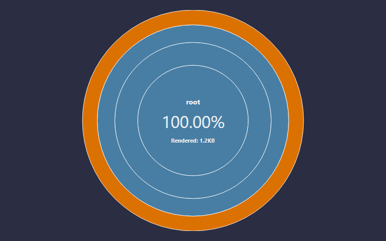
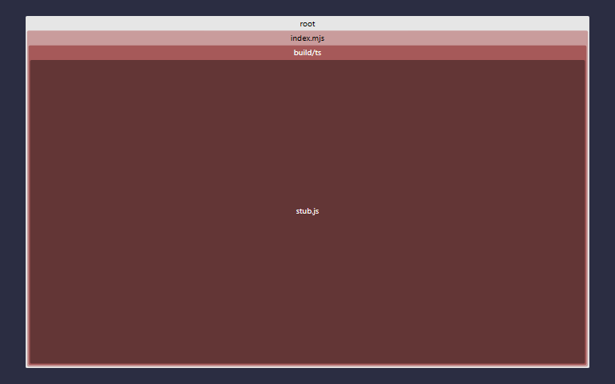
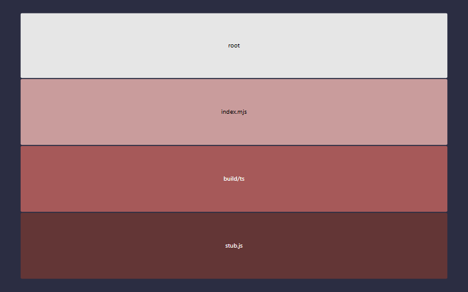

# fsl.tools v0.1.0

> Version 0.1.0 was built on Tuesday, June 2, 2026 at GMT-07:00 `1780409962723` from hash `3f12cde`.

TODO Put the project description here, please.

<!-- Supported embeds: 1780409962723 Tuesday, June 2, 2026 at GMT-07:00 66.66 2 50 3f12cde {{stochbranch}} 66.66 {{stochfunc}} {{stochline}} 4 33 {{unitbranch}} {{unitfunc}} {{unitline}} 29 0.1.0 -->

&nbsp;

&nbsp;

## Test status

<table>
  <tr>
    <th></th>
    <th>Count</th>
    <th>Statement</th>
    <th>Branch</th>
    <th>Func</th>
    <th>Line</th>
  </tr>
  <tr>
    <th>Unit</th>
    <td>29</td>
    <td>66.66<small>%</small></td>
    <td>{{unitbranch}}<small>%</small></td>
    <td>{{unitfunc}}<small>%</small></td>
    <td>{{unitline}}<small>%</small></td>
  </tr>
  <tr>
    <th>Stochastic</th>
    <td>4</td>
    <td>66.66<small>%</small></td>
    <td>{{stochbranch}}<small>%</small></td>
    <td>{{stochfunc}}<small>%</small></td>
    <td>{{stochline}}<small>%</small></td>
  </tr>
</table>

<table>
  <tr>
    <th></th>
    <th>Docblock count</th>
    <th>50<small>%</small></th>
  </tr>
  <tr>
    <th>Docblock coverage</th>
    <td>2</td>
    <td>50<small>%</small></td>
  </tr>
</table>

* [Site](https://stonecypher.github.io/fsl.tools/index.html)
* [Documentation](https://stonecypher.github.io/fsl.tools/docs/index.html)
* [Builds](https://www.github.com/stonecypher/fsl.tools/actions)
* [Source](https://www.github.com/stonecypher/fsl.tools/)

<table>
  <tr>
    <td></td>
    <td></td>
  </tr>
  <tr>
    <td></td>
    <td></td>
  </tr>
</table>

&nbsp;

&nbsp;

## License

MIT
